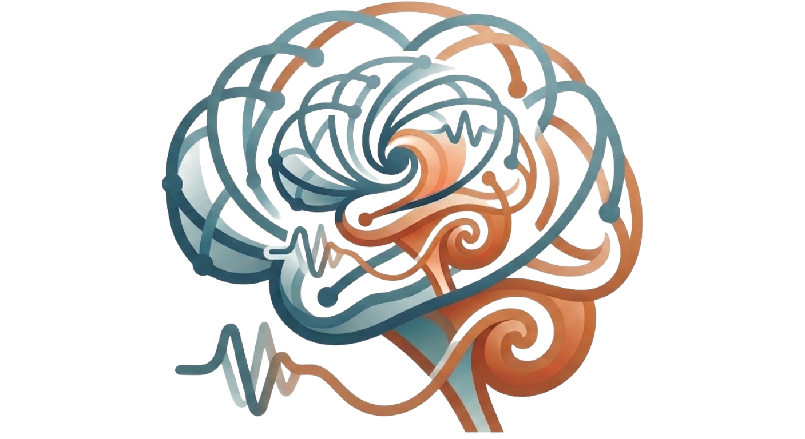

<p align="center">
  
</p>

<h1 align="center">SONATA</h1>

<p align="center">
  <b>S</b>tructure-t<b>O</b>-fu<b>N</b>ction via spectr<b>A</b>l <b>T</b>ract <b>A</b>ttributes
</p>

<p align="center">
  <em>A geometry-aware, edge-conditioned graph neural network that predicts an individual's
  functional connectome from a geometry-enriched structural connectome.</em>
</p>

---

SONATA uses **Laplace–Beltrami spectral shape descriptors** of cortical region
surfaces (node features) and white-matter tract isosurfaces (edge features).

SONATA ships with a **multi-backend compute layer** (CPU / JAX / CuPy / Torch for
arrays; PyMC / nutpie / NumPyro / BlackJAX for sampling), a **unified `n_threads`
parallelism** convention, **RAM/VRAM-aware batching**, a **publication-grade
visualization package**, and a **Bayesian attribution** extension.

> **On the science.** In a pooled cohort (*n* ≈ 110), no method here — spectral,
> diffusion, or graph-neural — beats the group-average functional connectome as an
> out-of-sample predictor. That is a *rigorous negative result*, obtained with
> leakage-safe cross-validation and a pre-registered non-inferiority margin, and
> it is consistent with the known ceiling on individual structure-to-function
> prediction. SONATA's most promising use is therefore **attribution** (which
> tracts/regions carry the small individual signal), not point prediction — see
> [`sonata/attribution.py`](sonata/attribution.py).

---

## Install

No PyPI project — install from the repository.

```bash
git clone https://github.com/rdneuro/sonata
cd sonata
pip install -e .'[all]'
```

or, in one line, straight from GitHub:

```bash
pip install git+https://github.com/rdneuro/sonata.git
```

Two runtime dependencies of the **full scientific pipeline** are not on PyPI and,
if you use that pipeline, must be installed first: a local editable
[`spectralbrain`](https://github.com/rdneuro/spectralbrain) (the spectral engine),
and a CUDA build of `torch` matching your driver
(`pip install torch --index-url https://download.pytorch.org/whl/cu124`). The
library imports and the infrastructure/visualization run without them.

---

## Quick start

The infrastructure and 2D visualization need only the scientific-Python core, so
these run on a plain `pip install -e .` install.

### 1 · Ask the machine what it can run

```python
from sonata import backends

caps = backends.capabilities()
caps.has_cuda            # True if a CUDA device is present
caps.array               # {'cpu': True, 'torch': ..., 'cupy': ..., 'jax': ...}
caps.usable_threads(-1)  # all usable cores, capped at 22

# The GPU cost model: small problems stay on the CPU (transfer would dominate).
backends.should_use_gpu(10_000)      # -> False
backends.should_use_gpu(5_000_000)   # -> True iff a GPU is present
```

### 2 · One `n_threads` convention everywhere

Every CPU-bound, parallelizable function takes `n_threads`: `1` serial, `>=2`
joblib workers, `-1` all usable cores (capped at 22). Inner BLAS threads are
pinned to 1 per worker so workers never oversubscribe the machine.

```python
from sonata.parallel import parallel_map

def row_norm(x):                       # top-level -> picklable
    return float((x ** 2).sum() ** 0.5)

norms = parallel_map(row_norm, list_of_arrays, n_threads=-1, progress=True)
```

### 3 · Build features for a cohort in parallel

```python
from sonata import SonataConfig
from sonata.graph import build_all_subject_features, load_all_cached_features
from sonata.utils import load_manifest

cfg = SonataConfig(); cfg.ensure()
manifest = load_manifest(cfg.paths.manifest_csv)

build_all_subject_features(manifest, cfg, n_threads=-1)   # resumable, cached
feats = load_all_cached_features(cfg)
```

or from the shell:

```bash
sonata-features --n-threads -1        # build + cache all subjects
sonata-run --n-threads -1             # features (if needed) then CV + baselines
```

### 4 · Visualize — including the evolutionary heatmap panel

```python
from sonata import viz

# a single labelled connectivity matrix
viz.heatmap(fc_matrix, title="predicted FC", cbar_label="Fisher-z")

# a grid of matrices across processing stages, shared scale + colourbar +
# a companion barplot summarising each stage (3x4 / 4x3, auto-laid-out)
viz.evolutionary_heatmaps(stage_matrices, stage_labels=labels, summary="mean_abs")

# the one-figure results story: benchmark bars + scatter + non-inferiority forest
viz.results_dashboard(model_labels=..., model_scores=..., benchmark=0.62,
                      pred=pred, true=true, ni_labels=..., ni_estimate=...,
                      ni_low=..., ni_high=..., ni_margin=-0.03)
```

Also available: `viz.bars`, `viz.scatter`, `viz.volcano`, `viz.lines`,
`viz.forest`, `viz.graphplot.connectome_graph`, and 3D renders in
`viz.brain3d` (`surface_scalar`, `tract_scalar`, `cortex_rois` via vedo /
nilearn / yabplot).

### 5 · Bayesian attribution

```python
from sonata.attribution import fit_attribution

# X: (n_subjects, n_features) aggregated tract/region features; y: a per-subject target
res = fit_attribution(X, y, feature_names=names, backend="auto",
                      draws=1000, tune=1000, target_accept=0.95)
res.significant()          # features whose 94% HDI excludes zero
res.mean, res.hdi_low, res.hdi_high, res.prob_direction
```

A full guided tour lives in [`examples/quickstart.py`](examples/quickstart.py)
(Spyder `# %%` cells).

---

## A little theory

**Laplace–Beltrami operator (LBO).** For a compact surface $\mathcal{M}$ with
metric $g$, the LBO is

$$\Delta_{\mathcal{M}} f = \tfrac{1}{\sqrt{|g|}}\,\partial_j\!\big(\sqrt{|g|}\,g^{jk}\,\partial_k f\big),$$

with eigenproblem $\Delta_{\mathcal{M}}\phi_i = -\lambda_i\phi_i$ giving a
non-negative spectrum $0=\lambda_1\le\lambda_2\le\cdots$. The spectrum is an
**isometry invariant**: bending a surface without stretching leaves every
eigenvalue unchanged, so descriptors built from it describe *shape*, not pose.

**Descriptors.** SONATA reduces each surface to a fixed-length vector:

- *ShapeDNA* — the area-normalized eigenvalue sequence (a global fingerprint),
- *Heat Kernel Signature* — $\mathrm{HKS}(x,t)=\sum_i e^{-\lambda_i t}\phi_i(x)^2$,
  multi-scale (local curvature at small $t$, global shape at large $t$),
- *Wave Kernel Signature* —
  $\mathrm{WKS}(x,e)\propto\sum_i \phi_i(x)^2\exp\!\big(-(e-\log\lambda_i)^2/2\sigma^2\big)$,
  a band-pass counterpart that localizes fine scales.

Every surface is truncated at the **same** eigen-index $k$ (`fixed_k=True`), so a
descriptor's length reflects the config, not the mesh size — removing a
size×shape confound. Surfaces too small to support $k$ yield an all-NaN
descriptor (flagged and imputed inside cross-validation).

**The network.** Each layer does explicit edge-conditioned message passing,

$$m'_{ij}=\mathrm{MLP}_e[h_i\,\|\,h_j\,\|\,m_{ij}],\quad
\bar a_i=\tfrac{1}{|\mathcal N(i)|}\!\!\sum_{j\in\mathcal N(i)}\!\!\mathrm{MLP}_m[\cdot],\quad
h'_i=h_i+\mathrm{LN}(\mathrm{MLP}_v[h_i\,\|\,\bar a_i]),$$

with a symmetric read-out so the predicted connectome is symmetric by
construction and permutation-equivariant to atlas relabelling.

**Attribution (regularized horseshoe).** The attribution model places a
global–local scale mixture on the coefficients,

$$\beta_i \sim \mathcal{N}\!\big(0,\ \tau^2\tilde\lambda_i^2\big),\quad
\tilde\lambda_i^2=\frac{c^2\lambda_i^2}{c^2+\tau^2\lambda_i^2},$$

(Piironen & Vehtari, 2017) — heavy tails leave genuine effects nearly unshrunk
while noise coefficients collapse to zero, so the posterior inclusion structure
*is* the attribution. Optional group horseshoe shrinks an entire tract block
together.

---

## Architecture

```
sonata/
├── backends/          multi-backend compute layer
│   ├── base.py        capability registry, GPU cost model, resolvers
│   ├── array.py       cpu | jax | cupy | torch  (uniform namespace + transfer)
│   └── bayes.py       pymc | nutpie | numpyro | blackjax  (MCMC dispatch)
├── parallel.py        unified n_threads joblib map + BLAS pinning
├── memory.py          RAM/VRAM probing, batch semaphores, OOM-safe batching
├── viz/               visualization package
│   ├── style.py       Okabe–Ito palette, publication rcParams, save helper
│   ├── heatmaps.py    solo labelled + evolutionary-panel heatmaps
│   ├── metrics.py     bar · scatter · volcano · line · forest
│   ├── panels.py      multi-panel composition + results dashboard
│   ├── graphplot.py   NetworkX connectome node-link
│   └── brain3d.py     vedo / nilearn / yabplot 3D renders (lazy)
├── spectral_features.py   LBO descriptors (fixed-k invariant) + parallel batch
├── graph.py           subject-graph assembly + parallel cohort build
├── model.py train.py cv.py baselines.py noninferiority.py   the GNN pipeline
├── attribution.py     regularized-horseshoe Bayesian attribution
├── config.py utils.py tract_mapping.py fs_schaefer.py ...   support
└── cli.py             `sonata-features`, `sonata-run`
```

`import sonata` is lazy: the infrastructure and config load with only the
scientific-Python core present; heavy pipeline symbols import their dependencies
on first use, so a partial install stays usable.

---

## Development

```bash
pip install -e .'[all]'
pytest -q
ruff check sonata
```

## License

MIT © Rodrigo Debona.

## Citation

If SONATA is useful in your work, please cite the repository and the underlying
methods (Reuter et al. 2006 · Sun et al. 2009 · Aubry et al. 2011 · Gilmer et
al. 2017 · Simonovsky & Komodakis 2017 · Piironen & Vehtari 2017).
